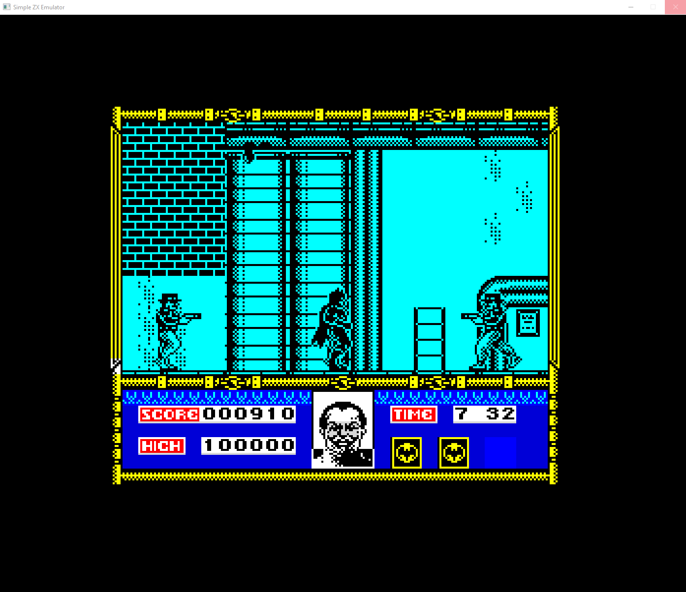
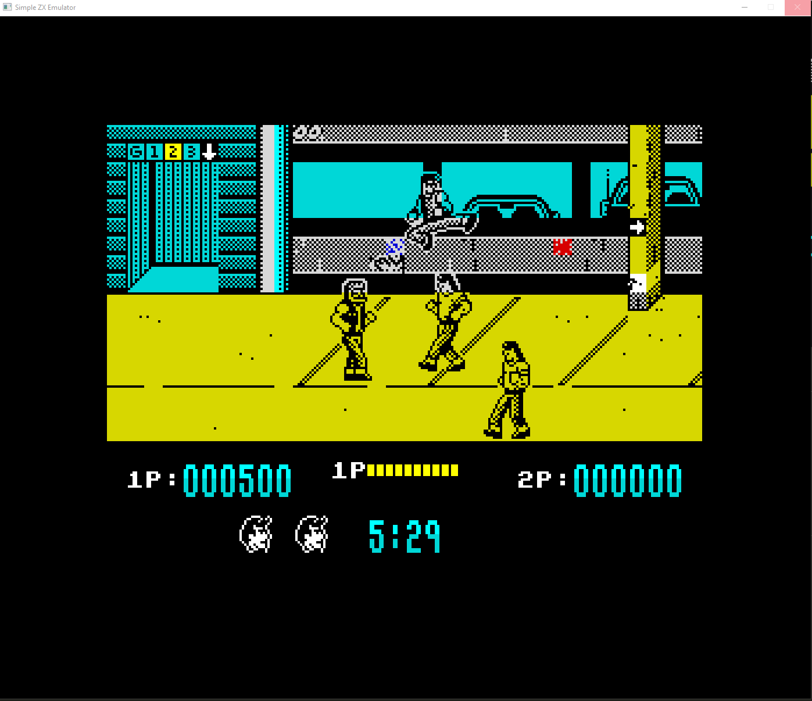

# Simple ZX Spectrum Emulator (szxe)

This project implements an emulator for the Sinclair ZX Spectrum 48K, written in C. It makes use of my Simple Z80 Emulator (sz80e), included as a static library and aims to provide an educational and functional base to understand the internal workings of the ZX Spectrum, as well as to serve as a starting point for retrocomputing, emulation, or embedded projects.

## Features

- Emulation of the Sinclair ZX Spectrum 48K.
- Uses the Z80 CPU core as a static library.
- Modular and easy-to-understand structure.
- Loads and runs .Z80 and .SNA files.
- SDL2-based video, audio and keyboard input.
- Visual Studio Code tasks provided for building and debugging.

## Project Structure

- `bin`: Binaries (ROM).
- `doc`: Screenshots for the README.md file.
- `inc`: Header files, including the public interface for the Z80 core, `z80_public`.
- `lib`: Folders for the sz80e core static library. Pre-compiled Windows and Linux versions included.
- `src`: Source code of the ZX Spectrum emulator.
- `makefile_linux`, `makefile_windows`: Make build scripts for Windows and Linux.
- `README.md`: This file.
- `szxe.exe`, `szxe`: Executables for Windows and Linux.

## Requirements

- GCC for compiling.
- LD for linking.
- [SDL2](https://www.libsdl.org/) development libraries.
- My [sz80e](https://github.com/fernando-cabrera-gonzalez/sz80e) static library.
- Compatible operating system (Windows or Linux).
- Recommended: GNU make and Visual Studio Code with C/C++ extension by Microsoft.

## Building

This project includes both the executables and the sz80e static libraries for Windows and Linux, but in case you want to do a rebuild:
- Define `SDL2_INC` and `SDL2_LIB` environment variables (more info in `tasks.json` and make files).
- Build the Z80 CPU static library as explained [here](https://github.com/fernando-cabrera-gonzalez/sz80e) and copy it to the `lib/windows` or `lib/linux` folders depending on your operating system.
- Run VS Code task "Build ZX emulator Windows" or "Build ZX emulator Linux" or run the appropriate makefile.

## Running

You can run the emulator with the following commands:

```sh
szxe.exe [ROM / .z80 / .sna file]    (Windows)
szxe     [ROM / .z80 / .sna file]    (Linux)
```

If no argument is given, only the ZX Spectrum ROM will be loaded.

## Debugger

- For complete info on the sz80e core debugger look [here](https://github.com/fernando-cabrera-gonzalez/sz80e).
- There's also an ULA debugger that can be enabled uncommenting this line in `zx_ula.h`:

```sh
#define ULA_DEBUG
```
  When enabled szxe wwill output one line for each ULA frame, showing the tstates used for each part of that frame:

    ```sh
    V = xxx, T = xxx, [L = xxx, S = xxx, R = xxx, H = xxx]*, B = xxx, TOTAL = xxx

    V = Vertical retrace
    T = Top border

    For each line:
        L = Left border
        S = Visible part of the sreen
        R = Right border
        H = Horizontal retrace

    B = Bottom border
    TOTAL = Frame total
    ```
## Screenshots

<p align="center">
  
  
</p>

## Author

Fernando Cabrera González
- LinkedIn: [Fernando Cabrera González](https://www.linkedin.com/in/fernando-cabrera-gonzález-3b256620)
- X: [@fcabrera_77](https://x.com/fcabrera_77)
- CommodoreSpain: [El Rincón de Fer](https://www.commodorespain.es/el-rincon-de-fer/)
- Series on the AmigaWave YouTube channel:
    - [How were games made on the Amiga?](https://youtube.com/playlist?list=PLJGQC1clVHNFnwfmWUz3W2uoJgx0Pj6u2&si=RM6vIbvmaD15IcuX)
    - [Basic Assembly Programming Course for the Amiga.](https://youtube.com/playlist?list=PLJGQC1clVHNH7jb3hanudeT_BnQs2Ilv0&si=VeIlJY8tVfef84P_)